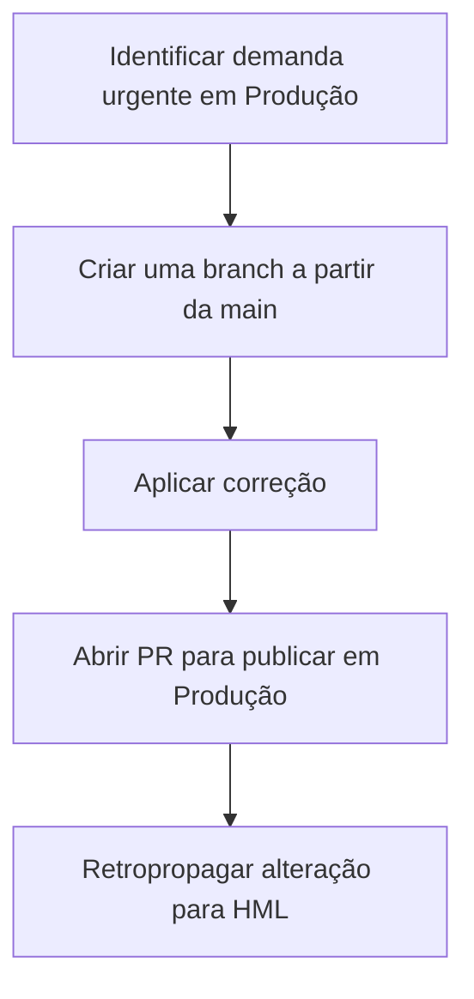

---

title: Versionamento
sidebar\_position: 3
description: Guia de versionamento por RM, fluxo HML → PRD (main) e exceções para urgências.
--------------------------------------------------------------------------------------------

## Visão Geral do Fluxo


---

## Regras de Nomeação e Branches Principais

* **Branches principais**

  * `hml` → Homologação
  * `main` → Produção (PRD)
* **Convenção de branches de feature (por RM)**

  * Criar **uma branch por atividade RM**.
  * Nomear usando o **número do RM** (ex.: `rm/12345`, `feature/rm-12345`).

---

## Fluxo Padrão (RM → HML → PRD)

```mermaid
graph TD
    A[Pegar atividade com número (RM)] --> B[Criar branch com nome do RM]
    B --> C[Finalizar desenvolvimento]
    C --> D[Enviar para branch HML]
    D --> E[Validação em HML]
    E -->|Validação OK| F[Promover para main (PRD)]
```

**Como funciona:**

1. Ao receber a atividade, **crie uma branch a partir de `hml`** usando o número do RM.
2. Desenvolva a feature na branch criada.
3. Envie para a branch `hml` para homologação.
4. Após testes e aprovação em HML, **promova para a branch `main` (produção)**.

---

## Fluxo de Urgência (PRD Direto)



**Como funciona:**

1. Em casos críticos cobrados diretamente em produção, a correção pode ser feita **na branch `main`** (PRD).
2. Após publicar em produção, **retropropague** a mesma alteração para `hml` para manter as branches alinhadas.

\:::danger Atenção
Use o fluxo de urgência **apenas** quando houver impacto imediato em Produção e com aprovação do time. Lembre-se de retropropagar para `hml`.
\:::
