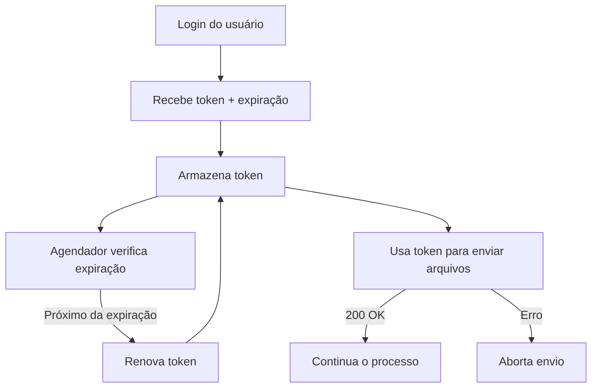

# Integração com API Autenticada por Token

## Autenticação

### 1. Login e Geração de Token

A primeira etapa é realizar um `POST` com os dados do usuário (login e senha) na API de autenticação:

```http
POST /auth/login
```

<details>
  <summary><strong>POST /auth/login</strong> - Autenticar e obter token</summary>
  

</details>

**Request Body (exemplo):**

```json
{
  "username": "admin",
  "password": "Admin@123"
}
```

**Resposta esperada:**

```json
{
  "_id": "...",
  "fullName": "Administrador do Sistema",
  "username": "admin",
  "token": "eyJ..."
}
```

* O token é válido por 1 hora.
* Em caso de erro (usuário e/ou senha inválidos), o retorno será:

```json
{
  "error": {
    "code": "00007",
    "message": "Usuário e/ou senha inválido(s)."
  }
}
```

### 2. Armazenamento do Token

Após obter o token, ele deve ser armazenado junto com o tempo de expiração (recomenda-se registrar `Date.now() + 3600000`).

## Renovação Automática do Token

### 3. Verificação de Expiração

O sistema deve verificar periodicamente se o token está prestes a expirar. Quando restarem poucos minutos, chame:

```http
GET /auth/tokenRefresh
```

**Resposta esperada:**

```json
{
  "newToken": "eyJ..."
}
```

* Esse novo token também é válido por 1 hora.
* Se o token atual estiver inválido, o retorno será `401 Unauthorized`.

## Validação de Token Ativo (Opcional)

Caso deseje validar se o token atual ainda está ativo e corresponde ao `multOrgId`, utilize:

```http
GET /auth/tokenValidate/{multOrgId}
```

**Resposta esperada:**

```json
{
  "message": "O token foi validado e pertence ao MultOrg."
}
```

## Envio de Arquivos com Token

### 4. Requisição com Token (Bearer)

O token deve ser utilizado como autenticação do tipo Bearer nas chamadas subsequentes, como no envio de arquivos:

```http
POST /api/envio
Authorization: Bearer eyJ...
Content-Type: multipart/form-data
```

**Regras:**

* Se o status da resposta for `200 OK`, o processo continua normalmente.
* Se houver erro de autenticação (`401`), a requisição deve ser cancelada e o erro logado.

## Cron e Agendamento

**Exemplo com `node-cron` (executa a cada 30 minutos):**

```js
const cron = require('node-cron');

cron.schedule('*/30 * * * *', () => {
  // Verificar tempo restante do token
  // Se necessário, renovar com GET /auth/tokenRefresh
});
```

**Boas práticas:**

* Evitar renovação caso não haja uso recente da aplicação.
* Armazenar token e data de expiração com precisão.
* Nunca expor tokens sensíveis em logs.

## Resumo do Fluxo



## Autor

Desenvolvido por Arthur Massimetti
