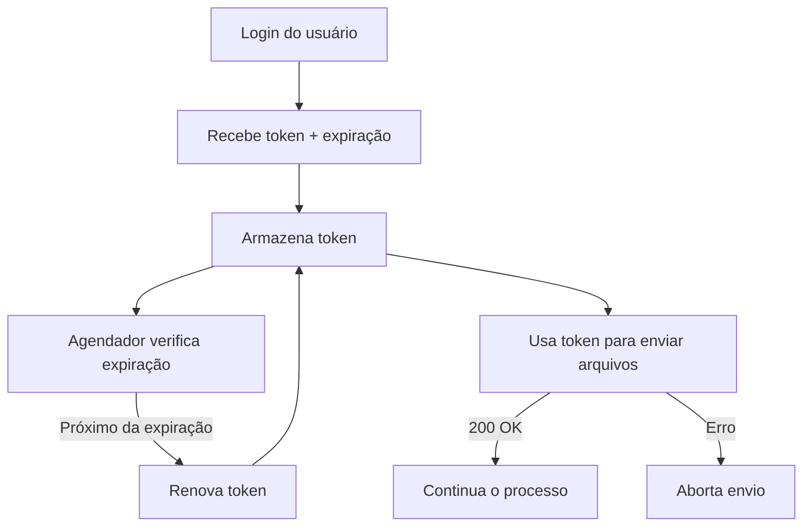

# Integração com API Autenticada por Token

## Visão Geral

Este projeto implementa um fluxo de integração com uma API que utiliza autenticação via token Bearer. O processo inclui:

* Obtenção inicial do token via login com usuário;
* Armazenamento do token com controle de expiração;
* Renovação do token automática com base no tempo restante;
* Envio de arquivos com validação de token;
* Prevenção de envio em caso de falha na autenticação.

## Autenticação

### 1. Login e Geração de Token

A primeira etapa é realizar um `POST` com os dados do usuário (login e senha) na API de autenticação:

```http
POST /auth/login
```

**Request Body (exemplo):**

```json
{
  "username": "seu_usuario",
  "password": "sua_senha"
}
```

**Resposta esperada:**

```json
{
  "access_token": "abc.def.ghi",
  "expires_in": 3600
}
```

### 2. Armazenamento do Token

Após obter o token, ele é armazenado em memória ou banco (dependendo do seu backend) junto com o tempo de expiração.

## Renovação Automática do Token

### 3. Verificação de Expiração

O sistema utiliza um agendador (como `node-cron`) para verificar periodicamente (ex: a cada 30 minutos) se o token está prestes a expirar.

Quando restarem poucos minutos para a expiração, um novo token é gerado via:

```http
GET /auth/tokenRefresh
```

O token só será renovado se ainda houver uso ativo da API. Caso contrário, a renovação é ignorada.

## Envio de Arquivos com Token

### 4. Requisição com Token (Bearer)

Ao enviar um arquivo, o token é incluído no cabeçalho da requisição:

```http
POST /api/envio
Authorization: Bearer abc.def.ghi
Content-Type: multipart/form-data
```

**Regras:**

* Se o status da resposta for `200 OK`, a requisição prossegue com o restante do processo.
* Se houver erro de autenticação (ex: `401`), o envio é cancelado e o erro é logado.

## Cron e Agendamento

**Exemplo com `node-cron` (executa a cada 30 minutos):**

```js
const cron = require('node-cron');

cron.schedule('*/30 * * * *', () => {
  // Verificar tempo restante do token
  // Se necessário, renovar com GET /auth/tokenRefresh
});
```

## Resumo do Fluxo



